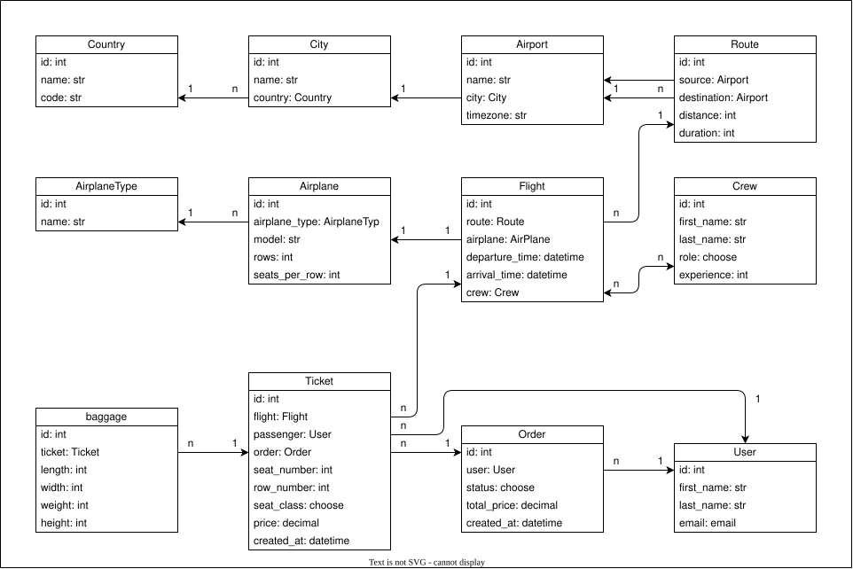

# ✈️ Airport DRF API Service

REST API for airport, flight and ticket management built with Django REST Framework.

The project provides airport and flight management, ticket booking, baggage handling, JWT authentication, role-based permissions, dynamic ticket pricing and a PostgreSQL-backed Docker environment.

---
## 📖 Contents

- [Features](#-features)
- [Tech Stack](#-tech-stack)
- [Architecture](#-architecture)
- [Authentication](#-authentication)
- [API Documentation](#-api-documentation)
- [Ticket Pricing](#-ticket-pricing)
- [Order Creation](#-order-creation)
- [Docker Setup](#-docker-setup)
- [Demo Credentials](#-demo-credentials)
- [Environment Variables](#-environment-variables)
- [Project Structure](#-project-structure)
- [Author](#author)

---

## 🚀 Features

- JWT authentication
- Custom User model with email-based authentication
- Role-based permissions
- Nested order creation (`Order → Ticket → Baggage`)
- Dynamic ticket pricing based on seat class and route distance
- Ticket and seat validation
- Filtering, search, ordering and pagination
- Optimized database queries with `select_related()` and `prefetch_related()`
- PostgreSQL
- Docker & Docker Compose
- Swagger / OpenAPI documentation
- Demo data loaded automatically on startup

---

## 🛠 Tech Stack

- Python 3.13
- Django 6.0
- Django REST Framework
- PostgreSQL 16
- SimpleJWT
- django-filter
- drf-spectacular
- Docker
- Docker Compose

---

## 🏗 Architecture


The diagram shows the relationships between the main entities of the airport booking system.
---
The project contains 12 main models:

1. `Country`
2. `City`
3. `Airport`
4. `AirplaneType`
5. `Airplane`
6. `Crew`
7. `Route`
8. `Flight`
9. `Order`
10. `Ticket`
11. `Baggage`
12. `User`

---

## 🔐 Authentication

Authentication is implemented using JWT.

### Obtain tokens

```http
POST /api/auth/login/
# Demo admin credentials:

{
    "email": "admin@example.com",
    "password": "SuperPass777"
}
```

Response:
```http
{
    "refresh": "<refresh_token>",
    "access": "<access_token>"
}
```

Use the access token in protected requests:
```http
Authorization: Bearer <access_token>
```

---

### Current User
```http
GET /api/auth/me/
```

### Registration
```http
POST /api/auth/register/
```

### If access token die - use Refresh Token endpoint:
```http
POST /api/auth/token-refresh/
```

---


## 📚 API Documentation

Interactive Swagger documentation is available at:
```http
GET /api/docs/
```

The Swagger UI can be used to explore endpoints, inspect request/response schemas and send API requests directly from the browser.

---

## 💰 Ticket Pricing
Ticket prices are calculated automatically by the API.

| Class | Base price | Distance rate |
|---|---:|---:|
| Economy | 50.00 | 0.01 |
| Premium Economy | 75.00 | 0.015 |
| Business | 100.00 | 0.02 |
| First | 150.00 | 0.025 |

Final ticket price:
```text
base price + route distance × class distance rate


```

---

## 🎟 Order Creation
Orders can be created together with multiple tickets and baggage.
```http
POST /api/airport/orders/
```
Example request:

```bash
{
    "tickets": [
        {
            "flight": 1,
            "row_number": 5,
            "seat_number": 1,
            "seat_class": "ECONOMY",
            "baggage": [
                {
                    "length": 60,
                    "height": 30,
                    "width": 40,
                    "weight": "20.00"
                }
            ]
        },
        {
            "flight": 1,
            "row_number": 5,
            "seat_number": 2,
            "seat_class": "BUSINESS",
            "baggage": []
        }
    ]
}
```
### The API automatically:
* creates the order;
* calculates ticket prices;
* creates tickets;
* creates baggage;
* calculates the total order price;
* prevents duplicate seats;
* rolls back the entire transaction if creation fails.

---

# 🐳 Docker Setup

### Requirements:
* Docker
* Dockercompose

### Run the project
```bash
git clone <repository-url>
cd airport-drf-api-service
cp .env.example .env
docker compose up --build
```

### On startup the project automatically:
1. runs database migrations;
2. creates the demo superuser;
3. loads demo data from fixtures;
4. starts Django.

PostgreSQL data is stored in a Docker volume.

---

## 🔑 Demo Credentials
```http
GET /admin/

Email: admin@example.com
Password: SuperPass777
```

---

# ⚙️ Environment Variables
```python
DEBUG=True
SECRET_KEY=change-me

POSTGRES_DB=airport
POSTGRES_USER=airport
POSTGRES_PASSWORD=change-me
POSTGRES_HOST=db
POSTGRES_PORT=5432
```

---

# 📁 Project Structure
```
airport-drf-api-service/
├── airport/
├── user/
├── fixtures/
├── manage.py
├── Dockerfile
├── docker-compose.yml
├── entrypoint.sh
├── requirements.txt
├── .env.example
├── .gitignore
└── README.md
```

---

# Author
## [SSSSSADO](https://github.com/SSSSSADO)
